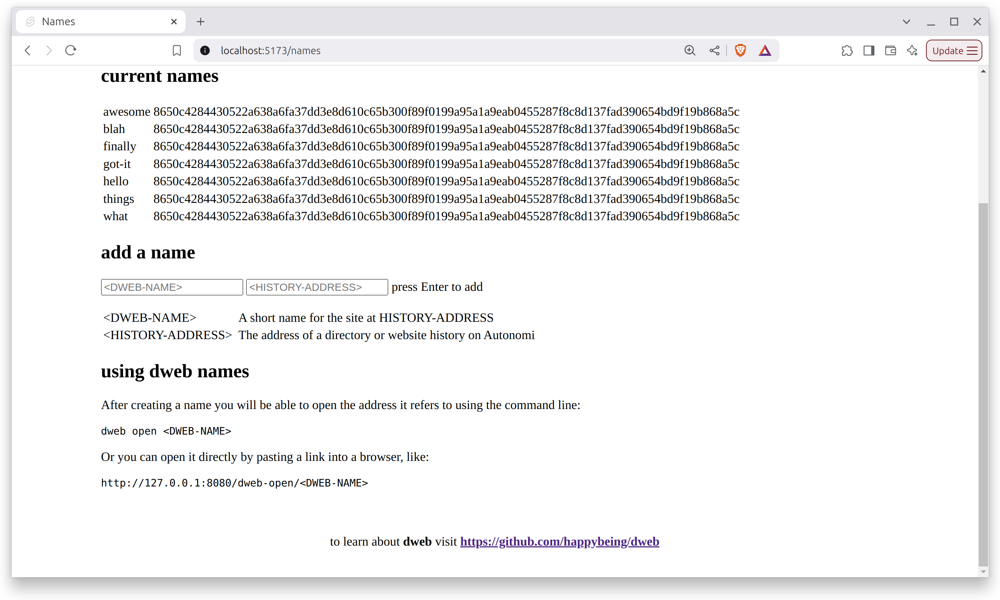

# Names

**Names** is a decentralised web app for creating and listing memorable names for websites and files on the Autonomi peer-to-peer network.

Decentralised web apps like names are regular static websites published to Autonomi using **dweb**, but become **dynamic websites** when using the dweb **RESTful HTTP API**.

At last, decentralised web apps and websites work in a **standard web browser** without any special plugins, configuration or changes by a user.

For more, including how to build apps like names, see [dweb](https://github.com/happybeing/dweb/blob/main/dweb-cli/README.md#dweb-command-line-app).

## Try Names on Autonomi
Names has not yet been published on the main Autonomi network. When it has you will be able to try it out as follows:
```
dweb serve
dweb open names
```
That will open your browser and load names from Autonomi. It's as simple as that. Here's an early names:


Until it has been deployed you can still use it on a local testnet as an example of how to develop your own decentralised web apps for Autonomi.

To start building your own decentralised app for Autonomi see the dweb documentation: [Develop a Decentralised Web App](https://github.com/happybeing/dweb/blob/main/dweb-cli/README.md#develop-a-decentralised-web-app).

## LICENSE

Everything is licensed under AGPL3.0 unless otherwise stated. Any contributions are accepted on the condition they conform to this license.

See also [./LICENSE](./LICENSE)
